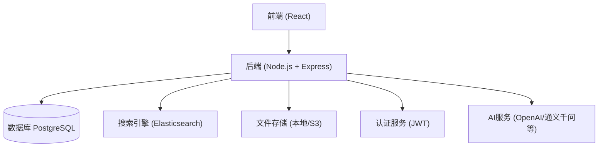
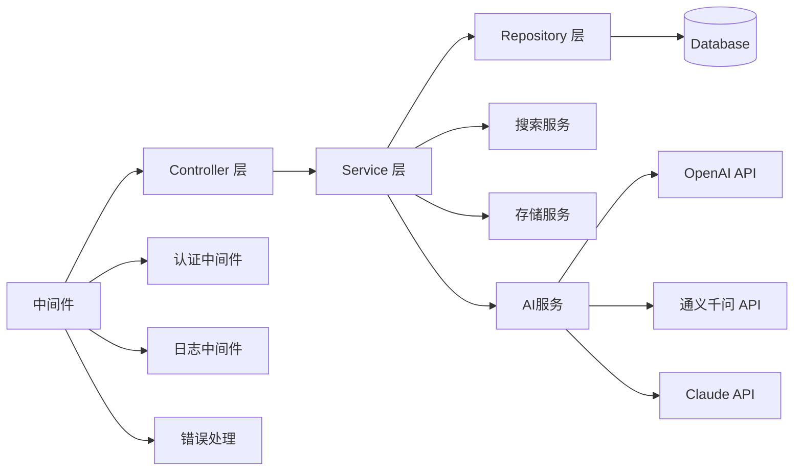
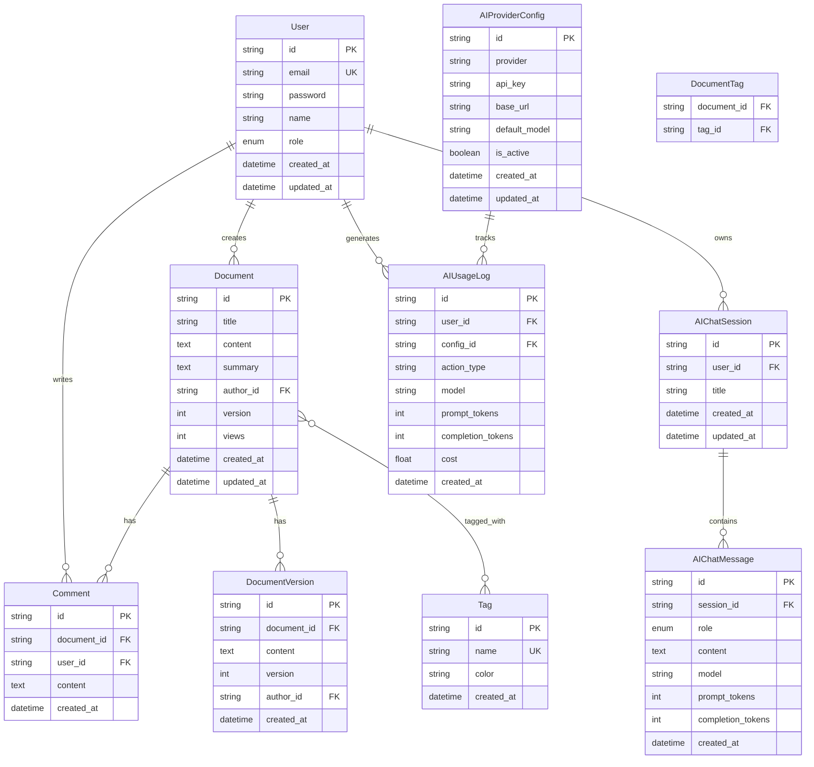

## 1. 架构设计



## 2. 技术描述

- **后端**: Node.js@20 + Express@4
- **数据库**: PostgreSQL 15
- **搜索引擎**: Elasticsearch 8.x
- **ORM**: Prisma 5.x
- **认证**: JWT (jsonwebtoken)
- **文件存储**: 本地存储 / AWS S3
- **AI集成**: OpenAI / 通义千问 / Claude等大模型API (LangChain)
- **API 文档**: Swagger/OpenAPI
- **测试**: Jest + Supertest

## 3. 后端 API 路由定义

| 路由 | 方法 | 用途 |
|------|------|------|
| /api/auth/login | POST | 用户登录 |
| /api/auth/register | POST | 用户注册 |
| /api/documents | GET | 获取文档列表 |
| /api/documents | POST | 创建文档 |
| /api/documents/:id | GET | 获取文档详情 |
| /api/documents/:id | PUT | 更新文档 |
| /api/documents/:id | DELETE | 删除文档 |
| /api/search | GET | 搜索文档 |
| /api/tags | GET | 获取标签列表 |
| /api/tags | POST | 创建标签 |
| /api/users | GET | 获取用户列表 (管理员) |
| /api/users/:id | PUT | 更新用户信息 |
| /api/stats | GET | 获取统计数据 |
| /api/ai/summarize | POST | AI生成文档摘要 |
| /api/ai/optimize | POST | AI内容优化建议 |
| /api/ai/tags | POST | AI自动标签建议 |
| /api/ai/chat | POST | AI智能问答 |
| /api/ai/models | GET | 获取可用AI模型 |

## 4. API 数据类型定义

```typescript
// 用户相关
interface User {
  id: string;
  email: string;
  name: string;
  role: 'admin' | 'editor' | 'user';
  createdAt: Date;
  updatedAt: Date;
}

interface LoginRequest {
  email: string;
  password: string;
}

interface LoginResponse {
  token: string;
  user: Omit<User, 'password'>;
}

// 文档相关
interface Document {
  id: string;
  title: string;
  content: string;
  summary?: string;
  authorId: string;
  tags: string[];
  version: number;
  createdAt: Date;
  updatedAt: Date;
}

interface CreateDocumentRequest {
  title: string;
  content: string;
  summary?: string;
  tags: string[];
}

// 搜索相关
interface SearchRequest {
  query: string;
  tags?: string[];
  page?: number;
  limit?: number;
}

interface SearchResponse {
  documents: Document[];
  total: number;
  page: number;
  limit: number;
}

// 标签相关
interface Tag {
  id: string;
  name: string;
  color?: string;
  createdAt: Date;
}

// 统计相关
interface Stats {
  totalDocuments: number;
  totalUsers: number;
  totalViews: number;
  popularDocuments: Document[];
  recentActivities: Activity[];
}

// AI相关
interface AISummarizeRequest {
  content: string;
  maxLength?: number;
  model?: string;
}

interface AISummarizeResponse {
  summary: string;
  model: string;
}

interface AIOptimizeRequest {
  content: string;
  type?: 'rewrite' | 'expand' | 'simplify' | 'formalize';
  model?: string;
}

interface AIOptimizeResponse {
  original: string;
  optimized: string;
  suggestions: string[];
  model: string;
}

interface AITagsRequest {
  title: string;
  content: string;
  maxTags?: number;
  model?: string;
}

interface AITagsResponse {
  tags: string[];
  model: string;
}

interface AIChatRequest {
  messages: { role: 'user' | 'assistant' | 'system'; content: string }[];
  contextDocuments?: string[];
  model?: string;
  temperature?: number;
}

interface AIChatResponse {
  message: string;
  model: string;
  citations?: { documentId: string; title: string }[];
}

interface AIModel {
  id: string;
  name: string;
  provider: string;
  type: 'text' | 'multimodal';
  contextWindow: number;
}
```

## 5. 服务器架构图



## 6. 数据模型

### 6.1 ER 图



### 6.2 Prisma Schema

```prisma
generator client {
  provider = "prisma-client-js"
}

datasource db {
  provider = "postgresql"
  url      = env("DATABASE_URL")
}

model User {
  id            String          @id @default(cuid())
  email         String          @unique
  password      String
  name          String
  role          Role            @default(USER)
  documents     Document[]
  comments      Comment[]
  chatSessions  AIChatSession[]
  usageLogs     AIUsageLog[]
  createdAt     DateTime        @default(now())
  updatedAt     DateTime        @updatedAt
}

model Document {
  id        String           @id @default(cuid())
  title     String
  content   String
  summary   String?
  authorId  String
  author    User             @relation(fields: [authorId], references: [id], onDelete: Cascade)
  tags      Tag[]            @relation("DocumentTags")
  versions  DocumentVersion[]
  comments  Comment[]
  version   Int              @default(1)
  views     Int              @default(0)
  createdAt DateTime         @default(now())
  updatedAt DateTime         @updatedAt
}

model Tag {
  id        String     @id @default(cuid())
  name      String     @unique
  color     String?
  documents Document[] @relation("DocumentTags")
  createdAt DateTime   @default(now())
}

model DocumentVersion {
  id         String   @id @default(cuid())
  documentId String
  document   Document @relation(fields: [documentId], references: [id], onDelete: Cascade)
  content    String
  version    Int
  authorId   String
  author     User     @relation(fields: [authorId], references: [id])
  createdAt  DateTime @default(now())
}

model Comment {
  id         String   @id @default(cuid())
  documentId String
  document   Document @relation(fields: [documentId], references: [id], onDelete: Cascade)
  userId     String
  user       User     @relation(fields: [userId], references: [id], onDelete: Cascade)
  content    String
  createdAt  DateTime @default(now())
}

model AIChatSession {
  id        String         @id @default(cuid())
  userId    String
  user      User           @relation(fields: [userId], references: [id], onDelete: Cascade)
  title     String
  messages  AIChatMessage[]
  createdAt DateTime       @default(now())
  updatedAt DateTime       @updatedAt
}

model AIChatMessage {
  id          String           @id @default(cuid())
  sessionId   String
  session     AIChatSession    @relation(fields: [sessionId], references: [id], onDelete: Cascade)
  role        AIChatMessageRole
  content     String
  model       String
  promptTokens Int?
  completionTokens Int?
  createdAt   DateTime         @default(now())
}

model AIProviderConfig {
  id           String         @id @default(cuid())
  provider     AIProvider
  apiKey       String
  baseUrl      String?
  defaultModel String
  isActive     Boolean        @default(true)
  usageLogs    AIUsageLog[]
  createdAt    DateTime       @default(now())
  updatedAt    DateTime       @updatedAt
}

model AIUsageLog {
  id               String          @id @default(cuid())
  userId           String
  user             User            @relation(fields: [userId], references: [id], onDelete: Cascade)
  configId         String
  config           AIProviderConfig @relation(fields: [configId], references: [id], onDelete: Cascade)
  actionType       AIActionType
  model            String
  promptTokens     Int
  completionTokens Int
  cost             Float
  createdAt        DateTime        @default(now())
}

enum Role {
  ADMIN
  EDITOR
  USER
}

enum AIChatMessageRole {
  USER
  ASSISTANT
  SYSTEM
}

enum AIProvider {
  OPENAI
  QWEN
  CLAUDE
  CUSTOM
}

enum AIActionType {
  SUMMARIZE
  OPTIMIZE
  GENERATE_TAGS
  CHAT
}
```
