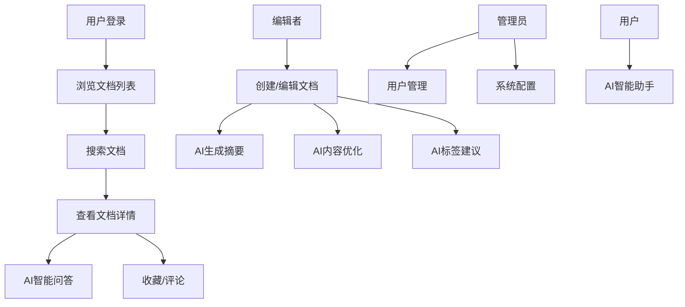

## 1. 产品概述
智慧知识库应用是一个用于管理和检索知识文档的智能系统，帮助组织高效存储、分类和搜索知识资源。
- 主要功能包括文档管理、智能搜索、AI增强、标签分类、权限管理和统计分析，目标用户为企业知识管理人员和员工
- 提高知识共享效率，降低信息检索成本，促进组织内部知识传承
- 集成AI能力，提供智能摘要生成、内容建议、智能问答等智能化服务

## 2. 核心功能

### 2.1 用户角色
| 角色 | 注册方法 | 核心权限 |
|------|---------|---------|
| 管理员 | 邮箱注册 | 完整的系统管理权限，包括用户管理、文档审核、系统配置 |
| 编辑者 | 邮箱注册/邀请 | 文档创建、编辑、删除权限 |
| 普通用户 | 邮箱注册/邀请 | 文档浏览、搜索、收藏权限 |

### 2.2 功能模块
1. **文档管理模块**: 文档上传、编辑、删除、版本控制
2. **智能搜索模块**: 全文搜索、关键词搜索、语义搜索
3. **AI增强模块**: 智能摘要生成、内容优化建议、基于知识库的智能问答、自动标签建议
4. **分类标签模块**: 标签管理、分类管理、文档分类
5. **权限管理模块**: 用户管理、角色管理、访问控制
6. **统计分析模块**: 使用统计、热门文档、搜索记录

### 2.3 页面详情
| 页面名称 | 模块名称 | 功能描述 |
|---------|---------|---------|
| 文档列表页 | 文档列表 | 展示所有文档，支持筛选、排序、分页 |
| 文档编辑页 | AI增强 | AI摘要生成、内容优化建议、自动标签建议 |
| 文档详情页 | 文档展示 | 展示文档内容、版本历史、评论、AI智能问答 |
| 搜索结果页 | 搜索功能 | 展示搜索结果，支持关键词高亮 |
| 智能助手页 | AI问答 | 基于知识库的AI智能问答 |
| 用户管理页 | 用户管理 | 管理员管理用户账号和权限 |
| 统计仪表盘 | 统计分析 | 展示系统使用情况和趋势 |

## 3. 核心流程
用户登录系统后，可以浏览文档、使用搜索功能查找需要的知识，也可以与AI助手进行智能问答。编辑者可以创建和编辑文档，并使用AI辅助功能提升效率。管理员负责用户管理和系统配置。

## 4. 用户界面设计
### 4.1 设计风格
- 主色调：蓝色系 (#165DFF)，辅助色：灰色系
- 按钮风格：圆角矩形，简洁现代
- 字体：Inter 或 Noto Sans，清晰易读
- 布局风格：卡片式布局，顶部导航
- 图标风格：线性图标，简洁统一

### 4.2 页面设计概述
| 页面名称 | 模块名称 | UI 元素 |
|---------|---------|---------|
| 文档列表页 | 文档卡片 | 白色卡片、浅灰背景、蓝色标题、悬停效果 |
| 搜索结果页 | 搜索栏 | 圆角搜索框、蓝色搜索按钮、高亮关键词 |
| 统计仪表盘 | 图表区域 | 渐变背景、数据卡片、图表组件 |

### 4.3 响应性
桌面优先设计，支持平板和移动端自适应，触摸操作优化

### 4.4 3D 场景指导
本项目暂不涉及 3D 场景
